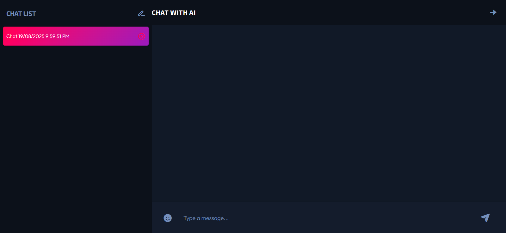

# AI ChatBot React App

A responsive AI-powered ChatBot built with React. Users can interact with the chatbot for answering questions, generating text, or performing simple tasks.

## Prerequisite

You must **sign in to puter.js** to obtain authentication before using this project.  
This ensures you have the necessary credentials (API key or token) to access its features.  
[Sign in to puter.js](https://puter.com) to get authentication.

## Features

- AI-driven responses
- Clean and responsive UI
- Easy to extend and customize

## Technologies Used

- React
- Puter.js (for AI responses)

## Live Demo

Check out the live AI ChatBot here: [AI ChatBot](https://chat-ai-react-puterjs.vercel.app/)

## Installation (Local)

1. Clone the repo:
   ```bash
   git clone https://github.com/nishant311/Chat-AI-React.git
   ```
2. Install dependencies:
   npm install

3. Start the development server:
   npm start

## Screenshots

Start Page:


Chat Interface:

